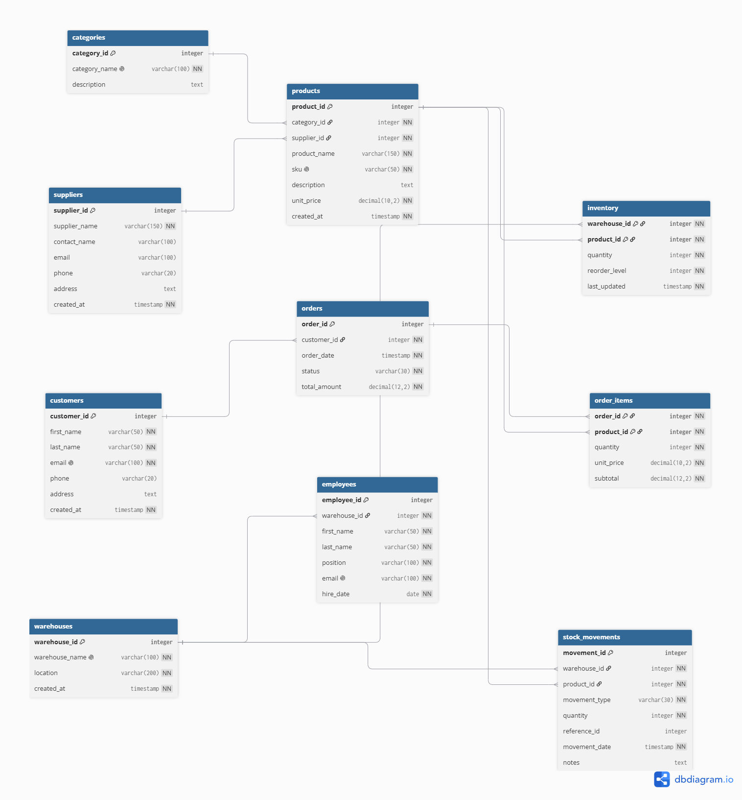

# Retail PostgreSQL DBA Project

## Objective
Design and administer a production-style PostgreSQL database for a retail inventory and order-management system, with a focus on data integrity, access control, query performance, and reliable backup and recovery.

## Scenario
A small computer-hardware retailer with two warehouses needs to track customers, products, suppliers, inventory, orders, and stock movements.

## Tech
- PostgreSQL
- pgAdmin 4
- dbdiagram.io (ERD)

## Database Design

The model has 10 tables: `customers`, `categories`, `suppliers`, `products`, `warehouses`, `employees`, `inventory`, `orders`, `order_items`, `stock_movements`.

Design notes:
- `inventory` resolves the many-to-many relationship between products and warehouses.
- `order_items` resolves the many-to-many relationship between orders and products, and stores a price snapshot so historical orders keep the price actually charged.
- `stock_movements` keeps an auditable history of stock changes (signed quantities).

## Status
- [x] Database design (ERD)
- [x] Schema, constraints, sample data
- [x] Constraint testing
- [ ] Analytical queries
- [ ] Security roles and least privilege
- [ ] Performance tuning (EXPLAIN ANALYZE, indexing)
- [ ] Backup and recovery (RPO/RTO)
- [ ] Monitoring
- [ ] Incident simulations

## How to rebuild the database
Run the scripts in `database/` in numeric order against a new database named `retail_operations`:

1. `01_database.sql`
2. `02_tables.sql`
3. `03_sample_data.sql`

Constraint tests are in `tests/constraint_tests.sql`.
