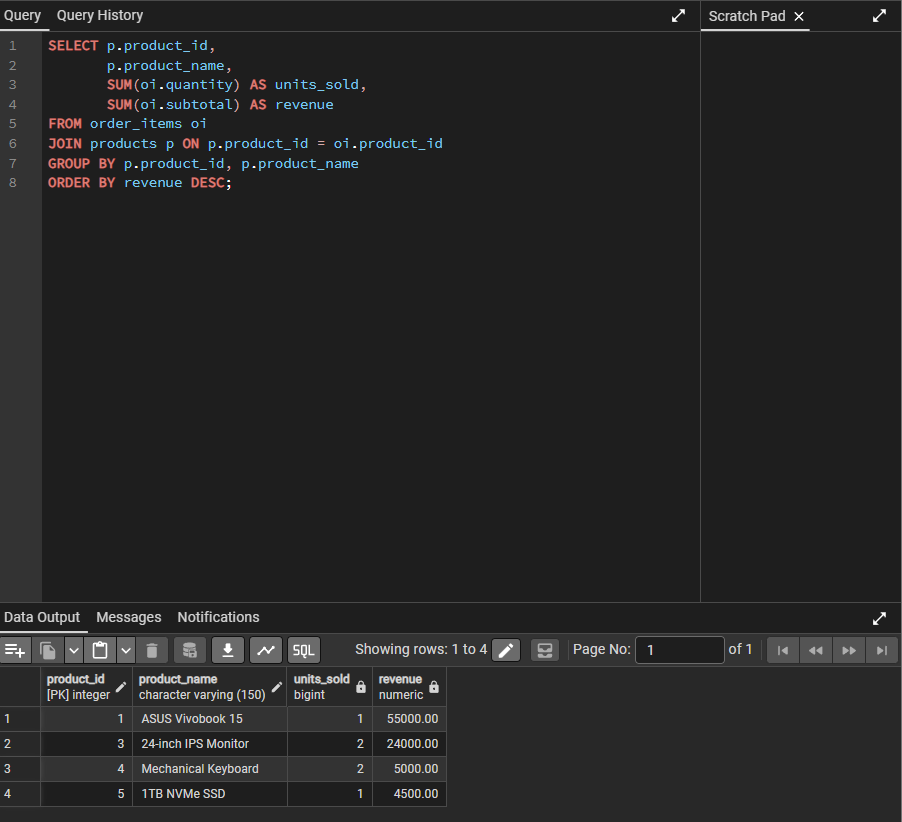
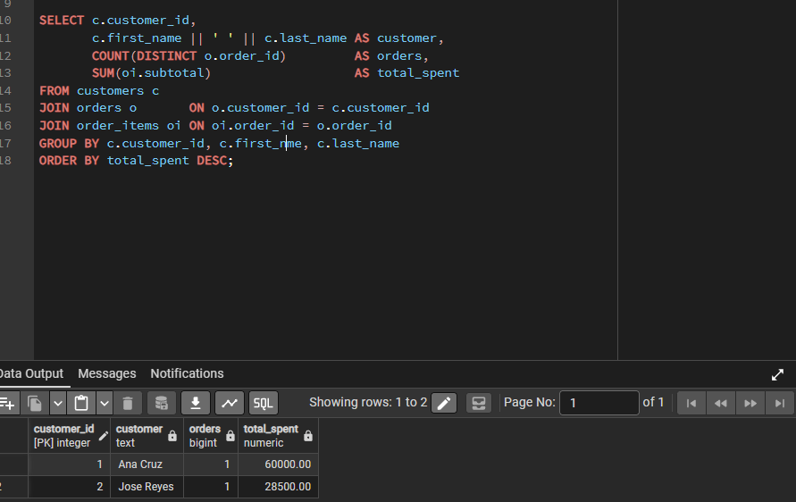
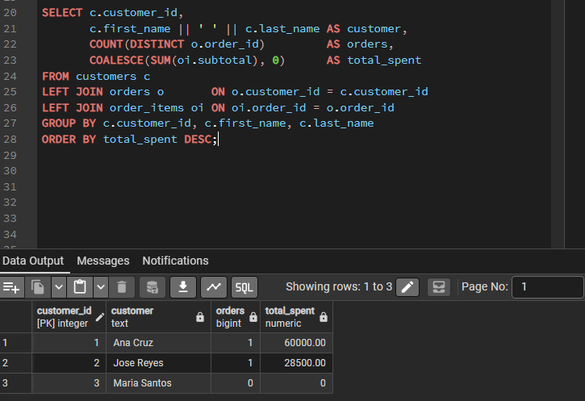
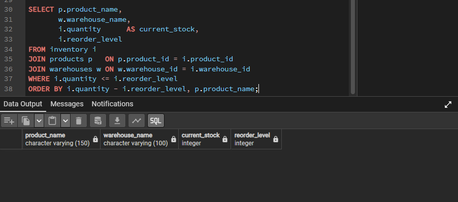
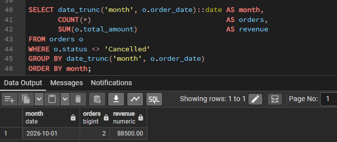
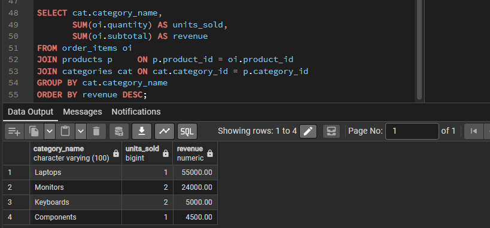
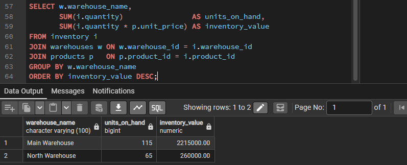
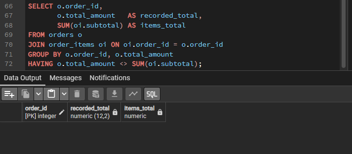

# Analytical Queries

Queries are in [`database/04_queries.sql`](../database/04_queries.sql). Results below are from the small sample dataset.

## Q1: Top-selling products
**Business question:** Which products generate the most revenue and sell the most units?

```sql
SELECT p.product_id, p.product_name,
       SUM(oi.quantity) AS units_sold,
       SUM(oi.subtotal) AS revenue
FROM order_items oi
JOIN products p ON p.product_id = oi.product_id
GROUP BY p.product_id, p.product_name
ORDER BY revenue DESC;
```



**Takeaway:** The ASUS Vivobook 15 generates the most revenue (55,000) from a single unit sold. The 24-inch monitor is second (24,000) from two units.

---

## Q2: Customer spending
**Business question:** Who are our highest-spending customers, and how many orders have they placed?

```sql
SELECT c.customer_id,
       c.first_name || ' ' || c.last_name AS customer,
       COUNT(DISTINCT o.order_id)         AS orders,
       SUM(oi.subtotal)                   AS total_spent
FROM customers c
JOIN orders o       ON o.customer_id = c.customer_id
JOIN order_items oi ON oi.order_id = o.order_id
GROUP BY c.customer_id, c.first_name, c.last_name
ORDER BY total_spent DESC;
```



**Takeaway:** Ana Cruz is the top spender (60,000 across 1 order), followed by Jose Reyes (28,500). Customers with no orders do not appear, because an inner join drops them (see Q3).

---

## Q3: Customer spending, including customers with no orders
**Business question:** Which customers have never placed an order, so we can target them with a promotion?

```sql
SELECT c.customer_id,
       c.first_name || ' ' || c.last_name AS customer,
       COUNT(DISTINCT o.order_id)         AS orders,
       COALESCE(SUM(oi.subtotal), 0)      AS total_spent
FROM customers c
LEFT JOIN orders o       ON o.customer_id = c.customer_id
LEFT JOIN order_items oi ON oi.order_id = o.order_id
GROUP BY c.customer_id, c.first_name, c.last_name
ORDER BY total_spent DESC;
```



**Takeaway:** Maria Santos appears with 0 orders and 0 spent. The `LEFT JOIN` keeps customers who have no matching orders, and `COALESCE` turns the resulting NULL total into 0.

---

## Q4: Low-stock products
**Business question:** Which products have fallen to or below their reorder level and need restocking, and in which warehouse?

```sql
SELECT p.product_name,
       w.warehouse_name,
       i.quantity      AS current_stock,
       i.reorder_level
FROM inventory i
JOIN products p   ON p.product_id = i.product_id
JOIN warehouses w ON w.warehouse_id = i.warehouse_id
WHERE i.quantity <= i.reorder_level
ORDER BY i.quantity - i.reorder_level, p.product_name;
```



**Takeaway:** No product is at or below its reorder level in the sample data, so the query returns no rows. To test it, a stock level was temporarily lowered below its reorder level, and the product appeared in the results.

---

## Q5: Monthly sales
**Business question:** How many orders and how much revenue do we get each month, and is it growing?

```sql
SELECT date_trunc('month', o.order_date)::date AS month,
       COUNT(*)                                AS orders,
       SUM(o.total_amount)                     AS revenue
FROM orders o
WHERE o.status <> 'Cancelled'
GROUP BY date_trunc('month', o.order_date)
ORDER BY month;
```



**Takeaway:** The sample data contains one month with 2 orders and 88,500 in revenue, so a growth trend can't be assessed yet. Cancelled orders are excluded from revenue. This query becomes more informative once bulk data with spread-out dates is loaded.

---

## Q6: Revenue by product category
**Business question:** Which product categories drive the most revenue, so we know where to focus purchasing?

```sql
SELECT cat.category_name,
       SUM(oi.quantity) AS units_sold,
       SUM(oi.subtotal) AS revenue
FROM order_items oi
JOIN products p     ON p.product_id = oi.product_id
JOIN categories cat ON cat.category_id = p.category_id
GROUP BY cat.category_name
ORDER BY revenue DESC;
```



**Takeaway:** Laptops lead with 55,000, driven by a single high-priced sale. Monitors follow with 24,000, then Keyboards (5,000) and Components (4,500).

---

## Q7: Inventory value per warehouse
**Business question:** How much money is tied up in stock at each warehouse?

```sql
SELECT w.warehouse_name,
       SUM(i.quantity)                AS units_on_hand,
       SUM(i.quantity * p.unit_price) AS inventory_value
FROM inventory i
JOIN warehouses w ON w.warehouse_id = i.warehouse_id
JOIN products p   ON p.product_id = i.product_id
GROUP BY w.warehouse_name
ORDER BY inventory_value DESC;
```



**Takeaway:** The Main Warehouse holds about 2,215,000 in stock versus 260,000 at the North Warehouse, roughly 90% of total inventory value, because it stocks the high-priced laptops and monitors.

---

## Q8: Order total check
**Business question:** Do any recorded order totals disagree with the items on those orders, indicating a data problem?

```sql
SELECT o.order_id,
       o.total_amount   AS recorded_total,
       SUM(oi.subtotal) AS items_total
FROM orders o
JOIN order_items oi ON oi.order_id = o.order_id
GROUP BY o.order_id, o.total_amount
HAVING o.total_amount <> SUM(oi.subtotal);
```



**Takeaway:** The query returns no rows, so every order's stored total matches the sum of its items. This is a data-quality check rather than a business report. `total_amount` is stored separately from the order items (a deliberate trade-off to keep historical totals), so it's worth being able to detect drift between them.