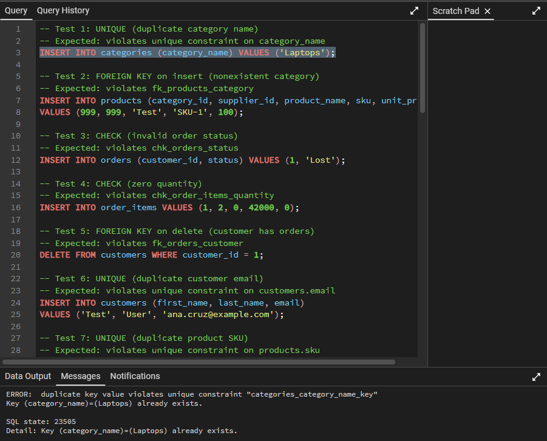
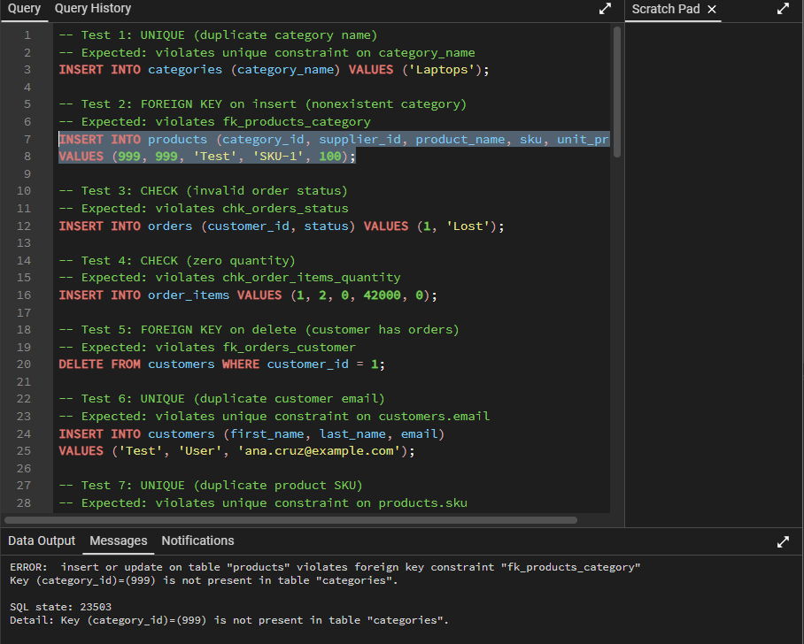
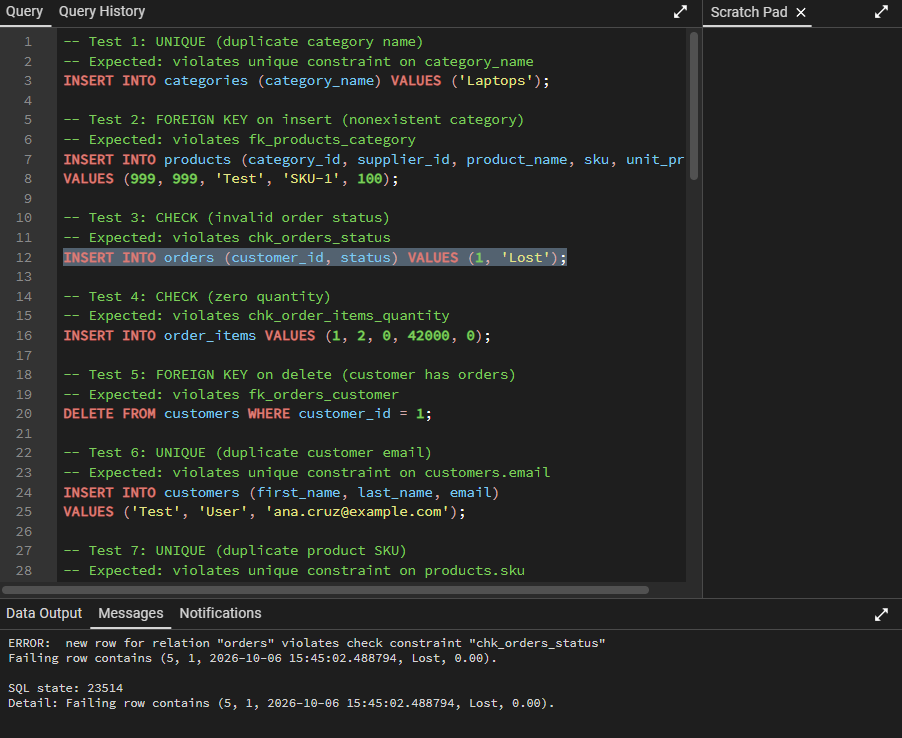
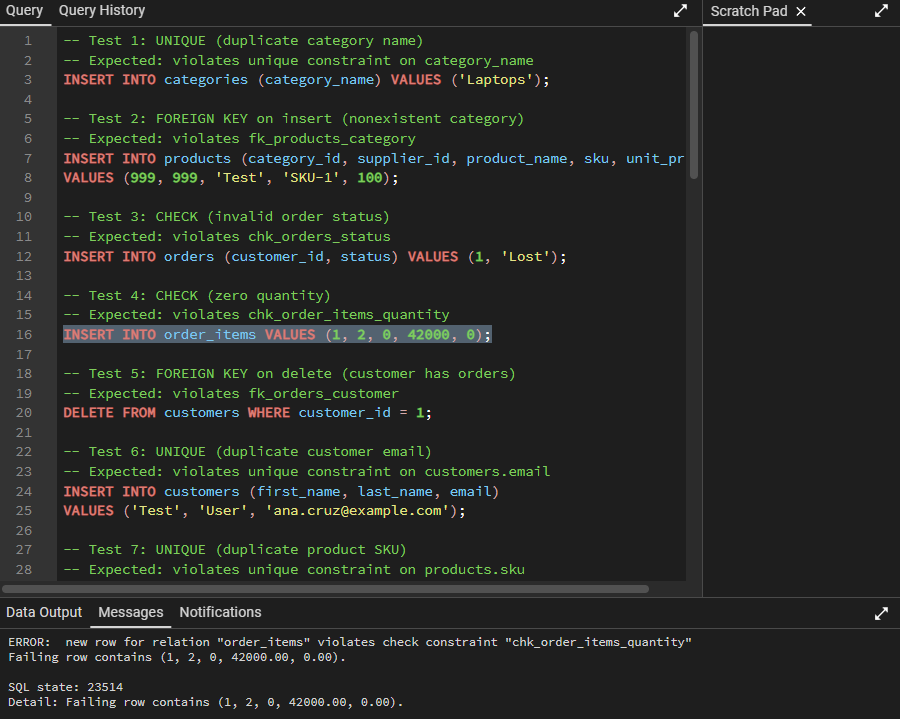
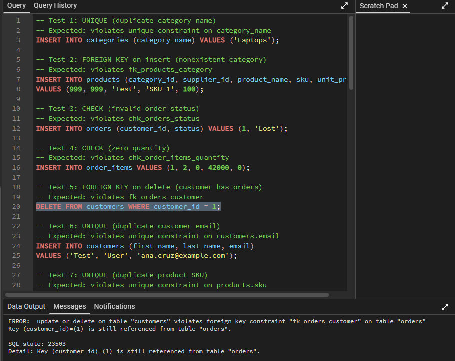

# Constraint Testing

## Purpose
Verify that the database rejects invalid data. Each test attempts an operation that should violate a constraint and records whether PostgreSQL rejected it.

All statements are in [`tests/constraint_tests.sql`](../tests/constraint_tests.sql). They were run one at a time against the sample data in `retail_operations`.

## Summary

| # | Constraint type | What was attempted | Expected constraint | Result |
|---|---|---|---|---|
| 1 | UNIQUE | Duplicate category name | unique constraint on `categories.category_name` | Rejected |
| 2 | FOREIGN KEY on insert | Product with a nonexistent category | `fk_products_category` | Rejected |
| 3 | CHECK | Order with an invalid status | `chk_orders_status` | Rejected |
| 4 | CHECK | Order item with zero quantity | `chk_order_items_quantity` | Rejected |
| 5 | FOREIGN KEY on delete | Delete a customer who has orders | `fk_orders_customer` | Rejected |
| 6 | UNIQUE | Duplicate customer email | unique constraint on `customers.email` | Rejected |
| 7 | UNIQUE | Duplicate product SKU | unique constraint on `products.sku` | Rejected |
| 8 | NOT NULL | Customer without an email | not-null constraint on `customers.email` | Rejected |
| 9 | NOT NULL | Product without a name | not-null constraint on `products.product_name` | Rejected |
| 10 | PRIMARY KEY | Same product twice in the same order | primary key on `order_items (order_id, product_id)` | Rejected |
| 11 | PRIMARY KEY | Second inventory row for the same warehouse and product | primary key on `inventory (warehouse_id, product_id)` | Rejected |
| 12 | FOREIGN KEY on insert | Order for a nonexistent customer | `fk_orders_customer` | Rejected |
| 13 | FOREIGN KEY on insert | Order item for a nonexistent product | `fk_order_items_product` | (fill in) |
| 14 | FOREIGN KEY on delete | Delete a product that has inventory and sales | a foreign key on `inventory` or `order_items` | Rejected |
| 15 | FOREIGN KEY on delete | Delete a warehouse that has stock and employees | a foreign key on `inventory`, `employees` or `stock_movements` | Rejected |
| 16 | CHECK | Product with a negative price | `chk_products_price` | Rejected |
| 17 | CHECK | Order with a negative total | `chk_orders_total` | Rejected |
| 18 | CHECK | Order item whose subtotal is not quantity x unit price | `chk_order_items_subtotal` | Rejected |
| 19 | CHECK | Order item with a negative unit price | `chk_order_items_price` | Rejected |
| 20 | CHECK | Negative stock level | `chk_inventory_quantity` | Rejected |
| 21 | CHECK | Stock movement with an invalid type | `chk_movements_type` | Rejected |
| 22 | CHECK | Stock movement with quantity 0 | `chk_movements_quantity` | Rejected |

## Test Details

### Test 1: UNIQUE (duplicate category name)
**Statement**
```sql
INSERT INTO categories (category_name) VALUES ('Laptops');
```
**Expected:** violates unique constraint on `categories.category_name`
**Result**
```
ERROR:  duplicate key value violates unique constraint "categories_category_name_key"
Key (category_name)=(Laptops) already exists.
```


### Test 2: FOREIGN KEY on insert (product with a nonexistent category)
**Statement**
```sql
INSERT INTO products (category_id, supplier_id, product_name, sku, unit_price)
VALUES (999, 999, 'Test', 'SKU-1', 100);
```
**Expected:** violates `fk_products_category`
**Result**
```
ERROR:  insert or update on table "products" violates foreign key constraint "fk_products_category"
Key (category_id)=(999) is not present in table "categories".
```


### Test 3: CHECK (order with an invalid status)
**Statement**
```sql
INSERT INTO orders (customer_id, status) VALUES (1, 'Lost');
```
**Expected:** violates `chk_orders_status`
**Result**
```
ERROR:  new row for relation "orders" violates check constraint "chk_orders_status"
Failing row contains (9, 1, 2026-10-07 14:56:47.406657, Lost, 0.00).
```


### Test 4: CHECK (order item with zero quantity)
**Statement**
```sql
INSERT INTO order_items VALUES (1, 2, 0, 42000, 0);
```
**Expected:** violates `chk_order_items_quantity`
**Result**
```
ERROR:  new row for relation "order_items" violates check constraint "chk_order_items_quantity"
Failing row contains (1, 2, 0, 42000.00, 0.00).
```


### Test 5: FOREIGN KEY on delete (delete a customer who has orders)
**Statement**
```sql
DELETE FROM customers WHERE customer_id = 1;
```
**Expected:** violates `fk_orders_customer`
**Result**
```
ERROR:  update or delete on table "customers" violates foreign key constraint "fk_orders_customer" on table "orders"
Key (customer_id)=(1) is still referenced from table "orders".
```


### Test 6: UNIQUE (duplicate customer email)
**Statement**
```sql
INSERT INTO customers (first_name, last_name, email)
VALUES ('Test', 'User', 'ana.cruz@example.com');
```
**Expected:** violates unique constraint on `customers.email`
**Result**
```
ERROR:  duplicate key value violates unique constraint "customers_email_key"
Key (email)=(ana.cruz@example.com) already exists.
```

### Test 7: UNIQUE (duplicate product sku)
**Statement**
```sql
INSERT INTO products (category_id, supplier_id, product_name, sku, unit_price)
VALUES (1, 1, 'Test Product', 'LAP-0001', 100);
```
**Expected:** violates unique constraint on `products.sku`
**Result**
```
ERROR:  duplicate key value violates unique constraint "products_sku_key"
Key (sku)=(LAP-0001) already exists.
```

### Test 8: NOT NULL (customer without an email)
**Statement**
```sql
INSERT INTO customers (first_name, last_name, email)
VALUES ('Test', 'User', NULL);
```
**Expected:** violates not-null constraint on `customers.email`
**Result**
```
ERROR:  null value in column "email" of relation "customers" violates not-null constraint
Failing row contains (9, Test, User, null, null, null, 2026-10-07 14:58:53.68805).
```

### Test 9: NOT NULL (product without a name)
**Statement**
```sql
INSERT INTO products (category_id, supplier_id, product_name, sku, unit_price)
VALUES (1, 1, NULL, 'TEST-0001', 100);
```
**Expected:** violates not-null constraint on `products.product_name`
**Result**
```
ERROR:  null value in column "product_name" of relation "products" violates not-null constraint
Failing row contains (18, 1, 1, null, TEST-0001, null, 100.00, 2026-10-07 14:59:21.180637).
```

### Test 10: PRIMARY KEY (same product twice in the same order)
**Statement**
```sql
INSERT INTO order_items (order_id, product_id, quantity, unit_price, subtotal)
VALUES (1, 1, 1, 55000.00, 55000.00);
```
**Expected:** violates primary key on `order_items (order_id, product_id)`
**Result**
```
ERROR:  duplicate key value violates unique constraint "order_items_pkey"
Key (order_id, product_id)=(1, 1) already exists.
```

### Test 11: PRIMARY KEY (second inventory row for the same warehouse and product)
**Statement**
```sql
INSERT INTO inventory (warehouse_id, product_id, quantity, reorder_level)
VALUES (1, 1, 10, 5);
```
**Expected:** violates primary key on `inventory (warehouse_id, product_id)`
**Result**
```
ERROR:  duplicate key value violates unique constraint "inventory_pkey"
Key (warehouse_id, product_id)=(1, 1) already exists.
```

### Test 12: FOREIGN KEY on insert (order for a nonexistent customer)
**Statement**
```sql
INSERT INTO orders (customer_id) VALUES (999);
```
**Expected:** violates `fk_orders_customer`
**Result**
```
ERROR:  insert or update on table "orders" violates foreign key constraint "fk_orders_customer"
Key (customer_id)=(999) is not present in table "customers".
```

### Test 13: FOREIGN KEY on insert (order item for a nonexistent product)
**Statement**
```sql
INSERT INTO order_items (order_id, product_id, quantity, unit_price, subtotal)
VALUES (1, 999, 1, 100.00, 100.00);
```
**Expected:** violates `fk_order_items_product`
**Result**
```
ERROR:  insert or update on table "order_items" violates foreign key constraint "fk_order_items_product"
Key (product_id)=(999) is not present in table "products". 
```

### Test 14: FOREIGN KEY on delete (delete a product that has inventory and sales)
**Statement**
```sql
DELETE FROM products WHERE product_id = 1;
```
**Expected:** violates a foreign key on `inventory` or `order_items`
**Result**
```
ERROR:  update or delete on table "products" violates foreign key constraint "fk_inventory_product" on table "inventory"
Key (product_id)=(1) is still referenced from table "inventory".
```

### Test 15: FOREIGN KEY on delete (delete a warehouse that has stock and employees)
**Statement**
```sql
DELETE FROM warehouses WHERE warehouse_id = 1;
```
**Expected:** violates a foreign key on `inventory`, `employees` or `stock_movements`
**Result**
```
ERROR:  update or delete on table "warehouses" violates foreign key constraint "fk_employee_warehouse" on table "employees"
Key (warehouse_id)=(1) is still referenced from table "employees".
```

### Test 16: CHECK (product with a negative price)
**Statement**
```sql
INSERT INTO products (category_id, supplier_id, product_name, sku, unit_price)
VALUES (1, 1, 'Test Product', 'TEST-0003', -500);
```
**Expected:** violates `chk_products_price`
**Result**
```
ERROR:  new row for relation "products" violates check constraint "chk_products_price"
Failing row contains (19, 1, 1, Test Product, TEST-0003, null, -500.00, 2026-10-07 15:02:04.336866).
```

### Test 17: CHECK (order with a negative total)
**Statement**
```sql
INSERT INTO orders (customer_id, total_amount) VALUES (1, -1);
```
**Expected:** violates `chk_orders_total`
**Result**
```
ERROR:  new row for relation "orders" violates check constraint "chk_orders_total"
Failing row contains (11, 1, 2026-10-07 15:02:13.891892, Pending, -1.00).
```

### Test 18: CHECK (order item whose subtotal is not quantity x unit price)
**Statement**
```sql
INSERT INTO order_items (order_id, product_id, quantity, unit_price, subtotal)
VALUES (1, 2, 1, 42000.00, 1.00);
```
**Expected:** violates `chk_order_items_subtotal`
**Result**
```
ERROR:  new row for relation "order_items" violates check constraint "chk_order_items_subtotal"
Failing row contains (1, 2, 1, 42000.00, 1.00).
```

### Test 19: CHECK (order item with a negative unit price)
**Statement**
```sql
INSERT INTO order_items (order_id, product_id, quantity, unit_price, subtotal)
VALUES (1, 2, 1, -5.00, -5.00);
```
**Expected:** violates `chk_order_items_price`
**Result**
```
ERROR:  new row for relation "order_items" violates check constraint "chk_order_items_price"
Failing row contains (1, 2, 1, -5.00, -5.00).
```

### Test 20: CHECK (negative stock level)
**Statement**
```sql
UPDATE inventory SET quantity = -1 WHERE warehouse_id = 1 AND product_id = 1;
```
**Expected:** violates `chk_inventory_quantity`
**Result**
```
ERROR:  new row for relation "inventory" violates check constraint "chk_inventory_quantity"
Failing row contains (1, 1, -1, 5, 2026-10-06 14:39:56.566359).
```

### Test 21: CHECK (stock movement with an invalid type)
**Statement**
```sql
INSERT INTO stock_movements (warehouse_id, product_id, movement_type, quantity)
VALUES (1, 1, 'DAMAGED', -1);
```
**Expected:** violates `chk_movements_type`
**Result**
```
ERROR:  new row for relation "stock_movements" violates check constraint "chk_movements_type"
Failing row contains (9, 1, 1, DAMAGED, -1, null, 2026-10-07 15:02:57.730599, null).
```

### Test 22: CHECK (stock movement with quantity 0)
**Statement**
```sql
INSERT INTO stock_movements (warehouse_id, product_id, movement_type, quantity)
VALUES (1, 1, 'ADJUSTMENT', 0);
```
**Expected:** violates `chk_movements_quantity`
**Result**
```
ERROR:  new row for relation "stock_movements" violates check constraint "chk_movements_quantity"
Failing row contains (10, 1, 1, ADJUSTMENT, 0, null, 2026-10-07 15:03:07.953191, null).
```

## Findings
- Every constraint type in the schema (UNIQUE, NOT NULL, PRIMARY KEY, FOREIGN KEY, CHECK) is covered by at least one test.
- Foreign keys use PostgreSQL's default behavior (no `ON DELETE CASCADE`), so a parent row cannot be deleted while child rows reference it. This prevents accidental loss of order history.
- A failed insert still consumes an identity (sequence) value, so IDs can have gaps after testing. This is normal PostgreSQL behavior.