# Performance Tuning

## Purpose
Find slow queries with `EXPLAIN (ANALYZE, BUFFERS)`, add indexes only where the plan and the measurements justify them, and record the results.

- Data generator: [`data/generate_data.sql`](../data/generate_data.sql)
- Experiments run: [`performance/performance_experiments.sql`](../performance/performance_experiments.sql)
- Indexes kept: [`database/06_indexes.sql`](../database/06_indexes.sql)

## Dataset

Generated with `generate_series()` so the tables are large enough for index decisions to matter.

| Table | Rows |
|---|---|
| customers | 50,000 |
| products | 2,000 |
| inventory | 10,000 |
| orders | 300,000 |
| order_items | 750,000 |
| stock_movements | 300,000 |

## Method
- Baseline measured with no indexes other than primary keys and UNIQUE constraints.
- Each query was run with `EXPLAIN (ANALYZE, BUFFERS)` and the scan type, buffers and `Execution Time` were recorded.
- Indexes were added one at a time, followed by `ANALYZE`, and the same queries were rerun.
- Indexes were kept only if the measured gain justified the cost (disk space and extra work on writes).

## Results Summary

| Query | Before | After | Speedup | Plan change |
|---|---|---|---|---|
| P1: orders for one customer | 150.3 ms* | 0.084 ms | ~1,800x | Seq Scan to Bitmap Index Scan |
| P2: customer history, newest first | 38.6 ms | 0.063 ms | ~610x | Seq Scan + Sort to Bitmap Index Scan + Sort |
| P3: sales of one product | 34.7 ms | 0.417 ms | ~83x | Seq Scan to Bitmap Index Scan |
| P4: recent stock movements | 36.3 ms | 0.066 ms | ~550x | Seq Scan + Sort to Index Scan (no sort) |

\* The P1 baseline was a first run with a cold cache (`read=1418` buffers came from disk). A warm sequential scan of the same table (P2's baseline) takes about 39 ms, so the real improvement for P1 is closer to 450x. The other baselines were warm runs.

Indexes kept:

| Index | Table | Used by |
|---|---|---|
| `idx_orders_customer_id` | `orders (customer_id)` | P1, P2 |
| `idx_order_items_product_id` | `order_items (product_id)` | P3 |
| `idx_stock_movements_product_wh_date` | `stock_movements (product_id, warehouse_id, movement_date DESC)` | P4 |

## P1: Orders for one customer

**Problem:** Looking up one customer's orders scanned the whole `orders` table. `customer_id` is a foreign key, and PostgreSQL does not index foreign key columns automatically.

**Investigation:**
```sql
EXPLAIN (ANALYZE, BUFFERS)
SELECT * FROM orders WHERE customer_id = 15234;
```
The plan used a `Parallel Seq Scan` and discarded about 99,997 rows per worker to return 8 rows.

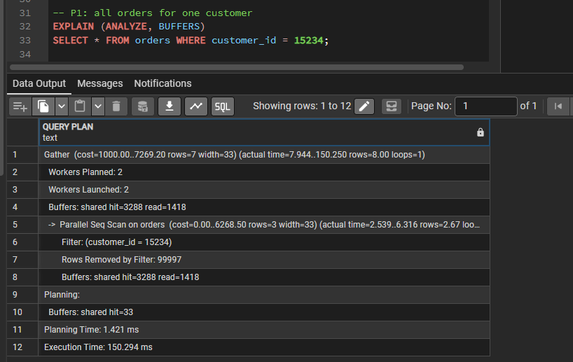

**Solution:**
```sql
CREATE INDEX idx_orders_customer_id ON orders (customer_id);
```

**Result:** A `Bitmap Index Scan` finds the 8 rows directly. Execution time went from 150.3 ms to 0.084 ms, and buffers touched dropped from about 4,700 to 11.

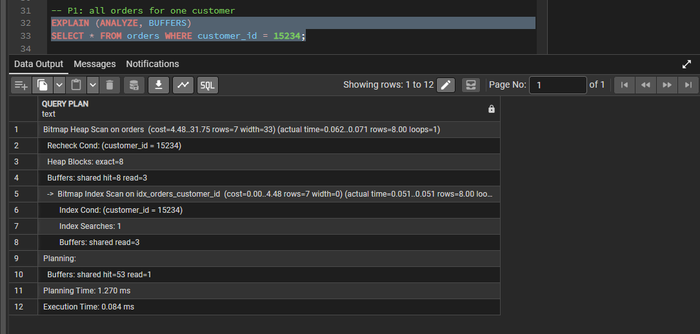

## P2: Customer order history, newest first

**Problem:** The same lookup with `ORDER BY order_date DESC` scanned the table and then sorted the matches (38.6 ms).

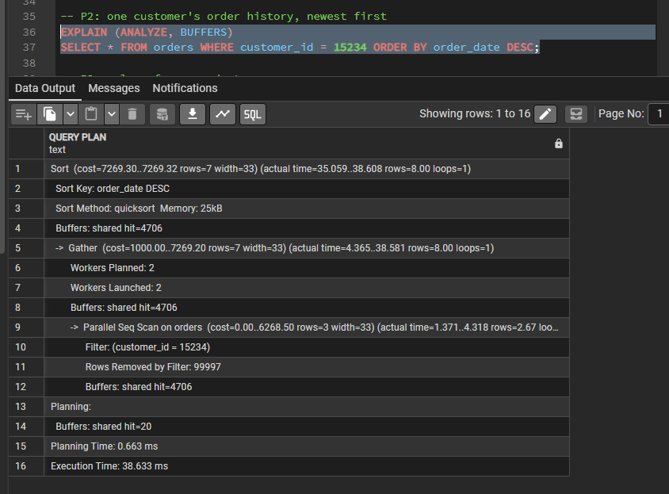

**Solution:** The index from P1 covers this query. The 8 matching rows are sorted in memory (25 kB).

**Result:** 0.063 ms.


## P3: Sales of one product

**Problem:** The primary key of `order_items` is `(order_id, product_id)`. Its first column is `order_id`, so a search by `product_id` alone cannot use it, and the query scanned all 750,000 rows (34.7 ms).

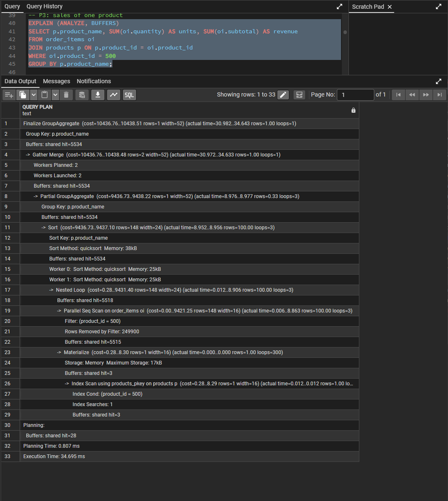

**Solution:**
```sql
CREATE INDEX idx_order_items_product_id ON order_items (product_id);
```

**Result:** A `Bitmap Index Scan` reads only the 300 matching rows, and the aggregation switched from sort-based to hash-based. Execution time went from 34.7 ms to 0.417 ms, and buffers dropped from 5,534 to about 300.

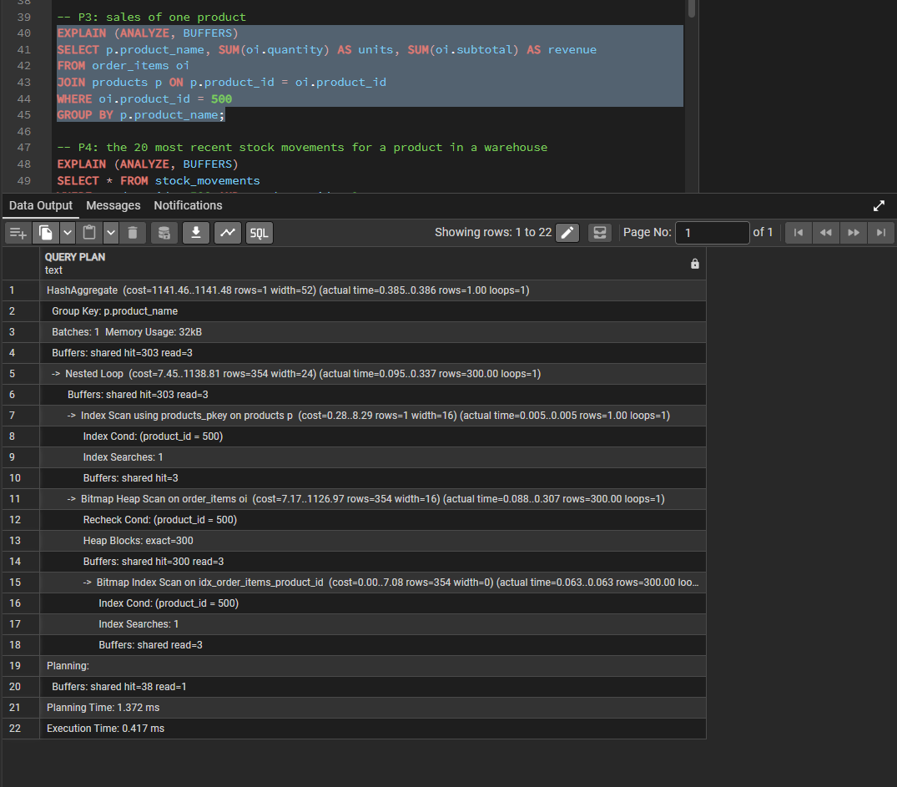

## P4: Recent stock movements for a product in a warehouse

**Problem:** The query filters on two columns, sorts by date and takes the newest 20. It scanned all 300,000 movements and sorted the matches (36.3 ms).

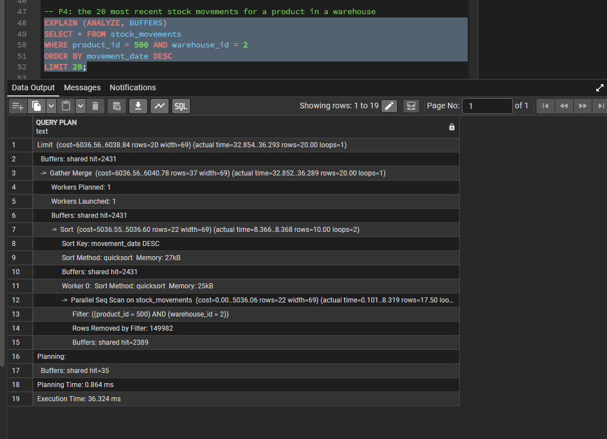

**Solution:**
```sql
CREATE INDEX idx_stock_movements_product_wh_date
    ON stock_movements (product_id, warehouse_id, movement_date DESC);
```

**Result:** An `Index Scan` reads the rows already in the requested order and stops after 20, so the sort disappeared from the plan. Execution time went from 36.3 ms to 0.066 ms, and buffers dropped from 2,431 to 23.

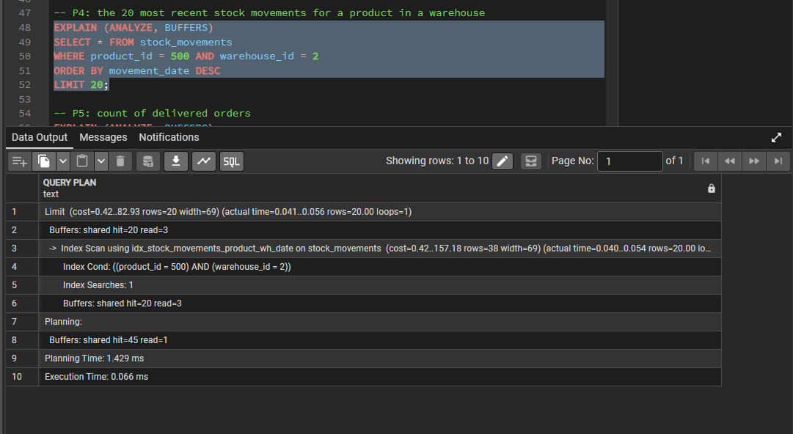

## Experiments: indexes that were not kept

### Composite index on orders (customer_id, order_date DESC)
**Question:** Does it improve P2 beyond the single-column index?

| | Single-column index | With composite |
|---|---|---|
| Index used | `idx_orders_customer_id` | `idx_orders_customer_date` |
| Sort step | Yes (8 rows) | Yes (8 rows) |
| Execution time | 0.063 ms | 0.062 ms |

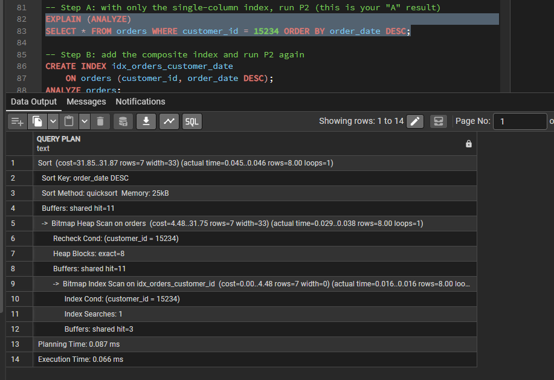
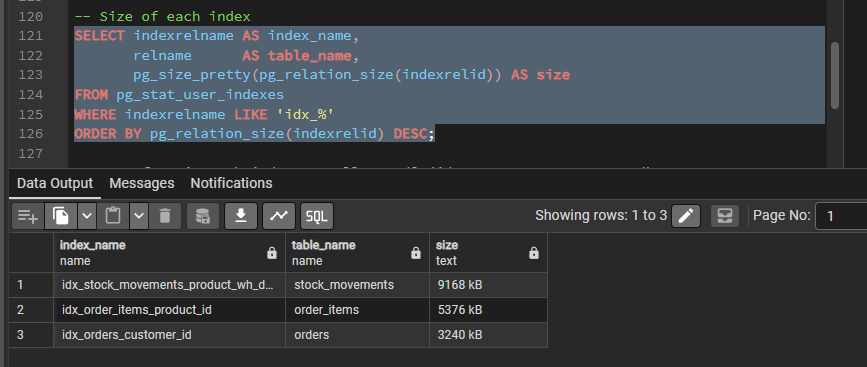

**Decision: dropped.** Each customer has only about 8 orders, so sorting them costs almost nothing and the composite saved no work. It would add disk space and slow inserts and updates for no measurable gain. This contrasts with P4, where the composite index removed a sort over many rows and allowed the query to stop after 20 rows.

### Index on orders (status)
**Question:** Is an index on a low-selectivity column worth it? `status` has 5 values, so each matches about 20% of the table.

| | No status index | With status index |
|---|---|---|
| Plan | Parallel Seq Scan | Index Only Scan |
| Execution time | 33.7 ms | 5.2 ms |
| Buffers | 4,706 | 68 |
| Index size | n/a | 2,080 kB |

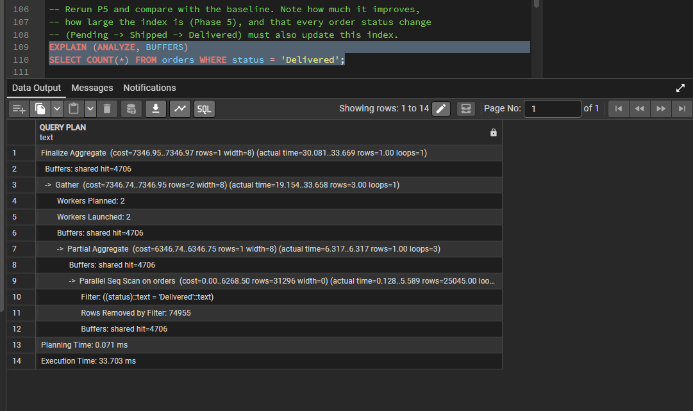
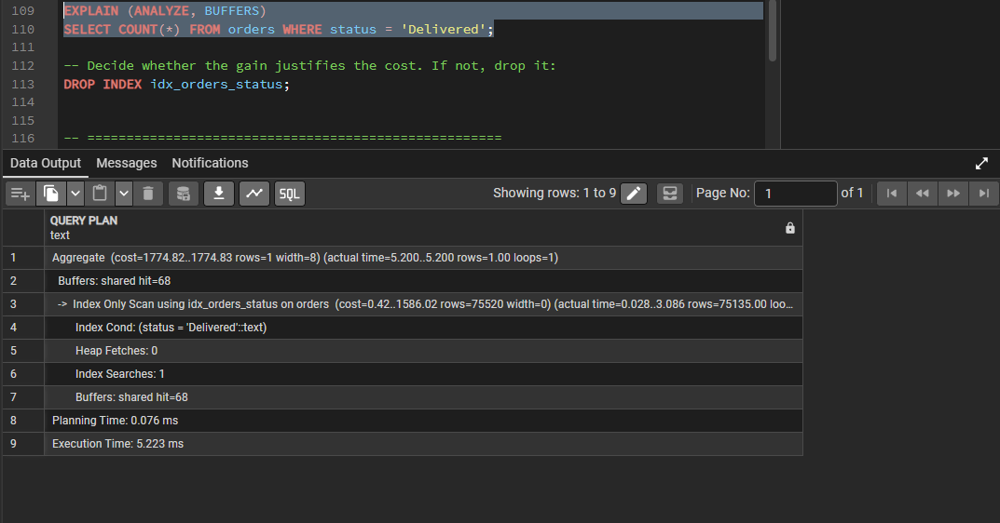

**Decision: dropped.** The index made the count about 6.5x faster, but the query was already fast (about 34 ms on 300,000 orders). The `status` column changes every time an order moves through its lifecycle, so each change would also have to update the index. The gain did not justify that ongoing cost for this workload. If a dashboard ran this count constantly, the decision could reasonably go the other way.

## Index Cost

| Index | Size |
|---|---|
| `idx_orders_customer_id` | 3240 kB |
| `idx_order_items_product_id` | 5376 kB |
| `idx_stock_movements_product_wh_date` | 9168 kB |

Query used:
```sql
SELECT indexrelname AS index_name,
       pg_size_pretty(pg_relation_size(indexrelid)) AS size
FROM pg_stat_user_indexes
WHERE indexrelname LIKE 'idx_%'
ORDER BY pg_relation_size(indexrelid) DESC;
```

## Findings
- Foreign key columns are not indexed automatically in PostgreSQL. Lookups by `orders.customer_id` and similar columns needed explicit indexes.
- A composite primary key only helps searches that start with its first column. `(order_id, product_id)` could not serve a search by `product_id`.
- A composite index pays off when it lets PostgreSQL skip a sort and stop early (P4). It did not help when the sort was tiny (P2).
- Not every index is worth keeping. Two experimental indexes were measured and dropped because the gain did not justify the cost.
- Reading the buffer counts matters as much as the time. Cold-cache runs can make a baseline look worse than it is, so comparisons should use warm runs.
