# Security and Access Control

## Purpose
Apply the principle of least privilege: each role gets only the access its job needs, and nothing is accessible by default. This document describes the roles, how access was granted, and the tests that verify it.

- Roles and grants: [`security/roles.sql`](../security/roles.sql)
- Tests: [`tests/security_tests.sql`](../tests/security_tests.sql)

## Roles

| Role | Can do | Cannot do |
|---|---|---|
| `database_admin` | Full control of the application tables and sequences | |
| `application_user` | Read, insert and update rows in `customers`, `orders`, `order_items`, `inventory`, `stock_movements`; read `products`, `categories`, `suppliers`, `warehouses` | Delete or truncate anything, read `employees`, change the schema |
| `reporting_user` | Read the six reporting views | Access any raw table |
| `readonly_user` | Read all tables and views | Insert, update or delete |

## Design Decisions
- **Public access removed.** Default privileges for `PUBLIC` on the database and the `public` schema are revoked, then access is granted back explicitly, one role at a time.
- **No deletes for the application.** `application_user` has no `DELETE` or `TRUNCATE`. Orders are cancelled by changing their status, not removed.
- **Reporting through views.** A view runs with its owner's privileges, so `reporting_user` can read `v_customer_spending` without any access to `customers`, `orders` or `order_items`.
- **Employee data restricted.** `application_user` has no access to `employees`.
- **No passwords in the repository.** Roles are created without passwords. Real passwords, if needed, are set locally with `ALTER ROLE ... PASSWORD` and never committed.
- **Re-runnable script.** `roles.sql` creates a role only if it does not already exist, and `GRANT` / `REVOKE` can be repeated safely.

## Setup
1. Run `database/05_views.sql` so the six views exist.
2. Run `security/roles.sql` while connected to `retail_operations` as a superuser.
3. Check the grants:

```sql
SELECT grantee, table_name, privilege_type
FROM information_schema.role_table_grants
WHERE grantee IN ('database_admin','application_user','reporting_user','readonly_user')
ORDER BY grantee, table_name, privilege_type;
```


## Testing Method
Tests use `SET ROLE` to act as each role without logging in, then `RESET ROLE` afterwards. Every role has tests for both what it should be denied and what it should be allowed to do.

## Summary

| # | Role | What was attempted | Expected | Result |
|---|---|---|---|---|
| S1 | `readonly_user` | Delete all products | Denied | (fill in) |
| S2 | `readonly_user` | Insert a category | Denied | (fill in) |
| S3 | `readonly_user` | Read products | Allowed | (fill in) |
| S4 | `reporting_user` | Read the raw `customers` table | Denied | (fill in) |
| S5 | `reporting_user` | Read `v_customer_spending` | Allowed | (fill in) |
| S6 | `application_user` | Delete an order | Denied | (fill in) |
| S7 | `application_user` | Truncate `inventory` | Denied | (fill in) |
| S8 | `application_user` | Read `employees` | Denied | (fill in) |
| S9 | `application_user` | Drop `customers` | Denied | (fill in) |
| S10 | `application_user` | Update inventory (then roll back) | Allowed | (fill in) |
| S11 | `database_admin` | Read `orders` | Allowed | Allowed |

## Test Details

### Test S1: readonly_user tries to delete data
**Statement**
```sql
SET ROLE readonly_user;
DELETE FROM products;
RESET ROLE;
```
**Expected:** permission denied for table products
**Result**
```
ERROR:  permission denied for table products 
```
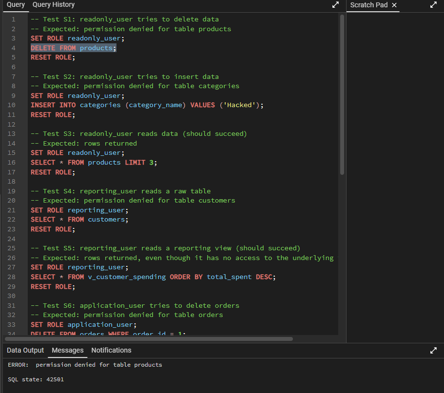

### Test S2: readonly_user tries to insert data
**Statement**
```sql
SET ROLE readonly_user;
INSERT INTO categories (category_name) VALUES ('Hacked');
RESET ROLE;
```
**Expected:** permission denied for table categories
**Result**
```
ERROR:  permission denied for table categories 
```
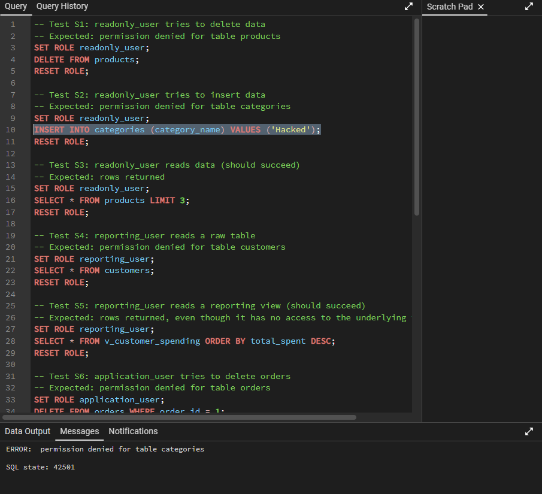

### Test S3: readonly_user reads data
**Statement**
```sql
SET ROLE readonly_user;
SELECT * FROM products LIMIT 3;
RESET ROLE;
```
**Expected:** rows returned
**Result**
```
observe the screenshot below for the result.
```
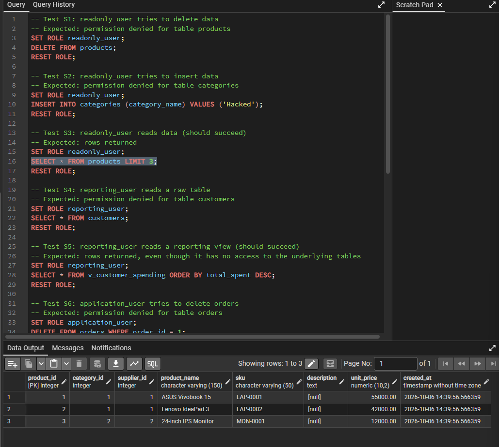

### Test S4: reporting_user tries to read a raw table
**Statement**
```sql
SET ROLE reporting_user;
SELECT * FROM customers;
RESET ROLE;
```
**Expected:** permission denied for table customers
**Result**
```
ERROR:  permission denied for table customers 
```
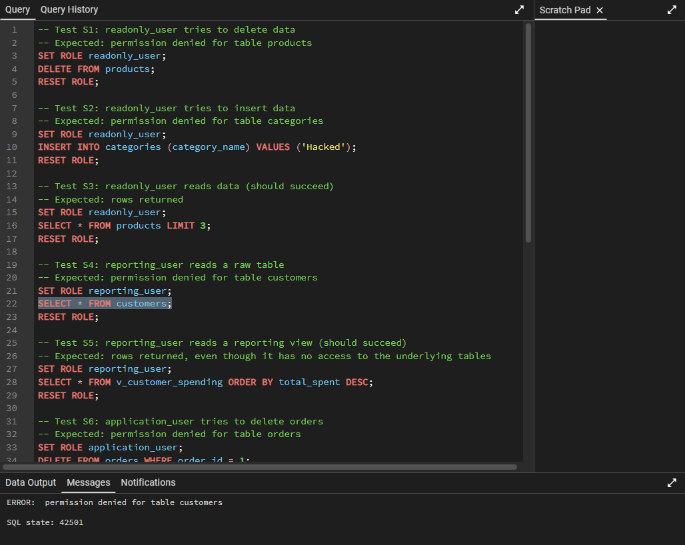

### Test S5: reporting_user reads a reporting view
**Statement**
```sql
SET ROLE reporting_user;
SELECT * FROM v_customer_spending ORDER BY total_spent DESC;
RESET ROLE;
```
**Expected:** rows returned, even though the role has no access to the underlying tables
**Result**
```
observe the screenshot below for the result.
```
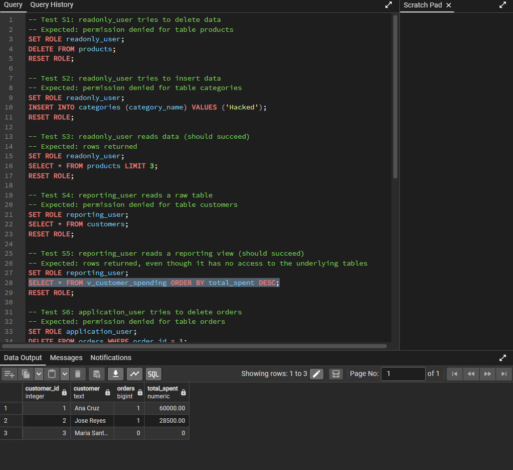

### Test S6: application_user tries to delete orders
**Statement**
```sql
SET ROLE application_user;
DELETE FROM orders WHERE order_id = 1;
RESET ROLE;
```
**Expected:** permission denied for table orders
**Result**
```
ERROR:  permission denied for table orders 
```
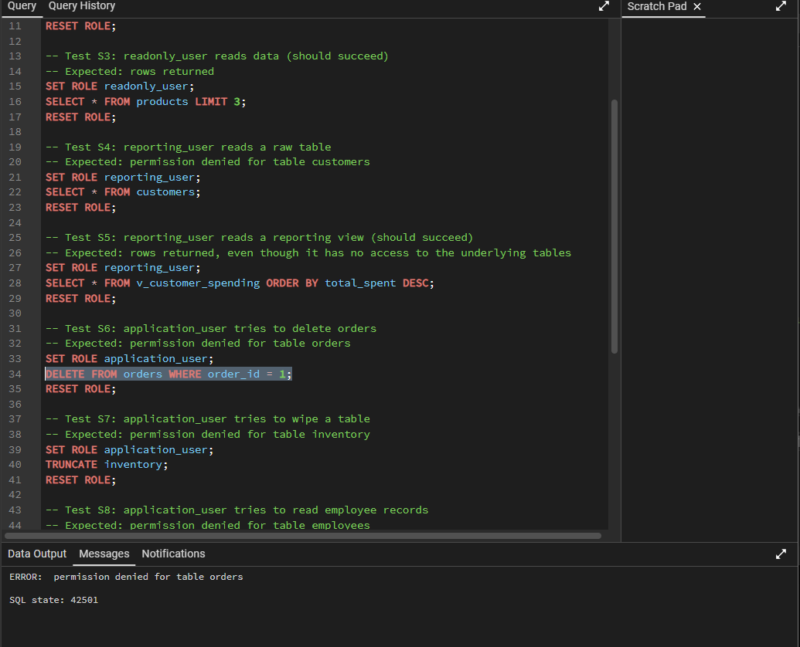

### Test S7: application_user tries to truncate a table
**Statement**
```sql
SET ROLE application_user;
TRUNCATE inventory;
RESET ROLE;
```
**Expected:** permission denied for table inventory
**Result**
```
ERROR:  permission denied for table inventory 
```
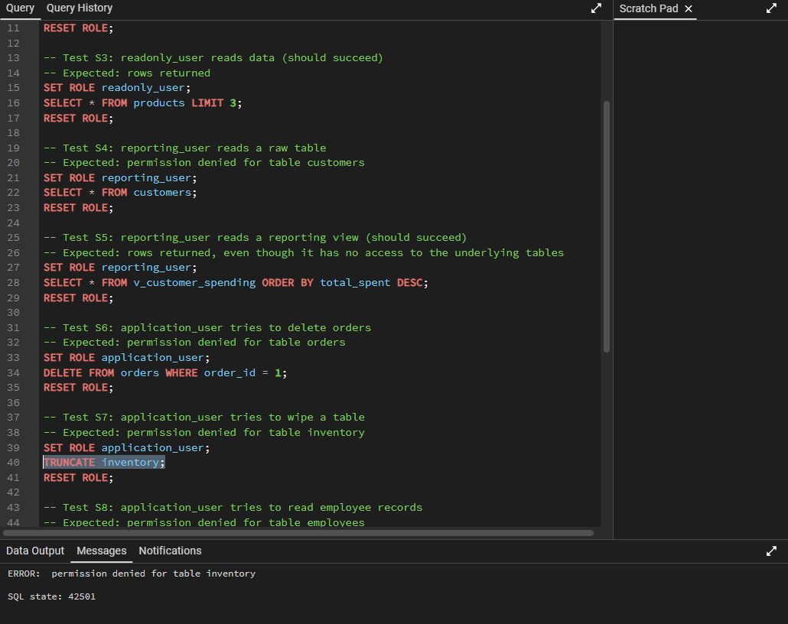

### Test S8: application_user tries to read employee records
**Statement**
```sql
SET ROLE application_user;
SELECT * FROM employees;
RESET ROLE;
```
**Expected:** permission denied for table employees
**Result**
```
ERROR:  permission denied for table employees 
```
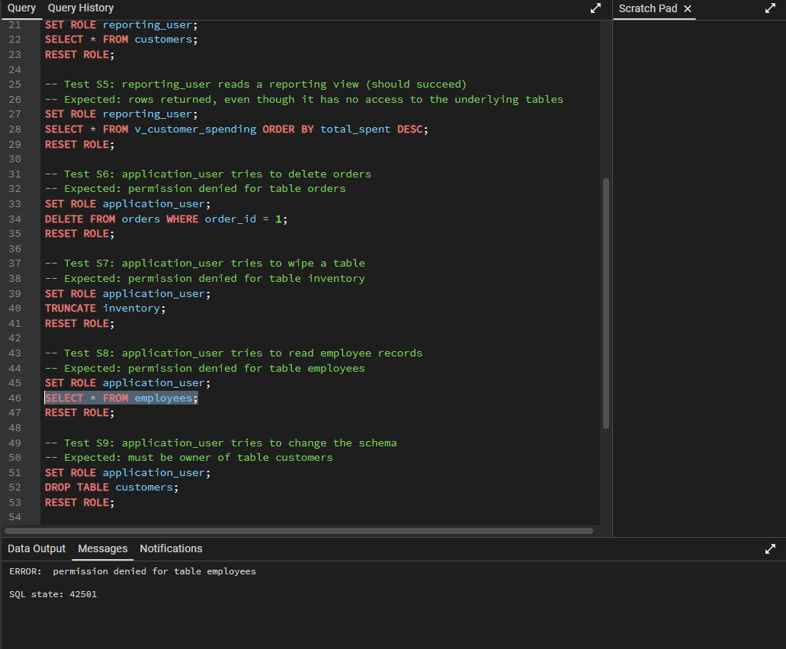

### Test S9: application_user tries to change the schema
**Statement**
```sql
SET ROLE application_user;
DROP TABLE customers;
RESET ROLE;
```
**Expected:** must be owner of table customers
**Result**
```
ERROR:  must be owner of table customers 
```
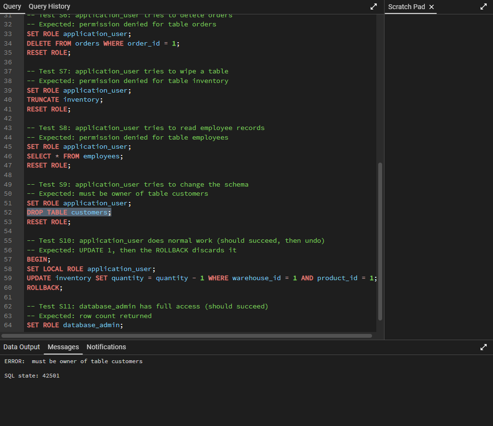

### Test S10: application_user does normal work
**Statement**
```sql
BEGIN;
SET LOCAL ROLE application_user;
UPDATE inventory SET quantity = quantity - 1 WHERE warehouse_id = 1 AND product_id = 1;
ROLLBACK;
```
**Expected:** `UPDATE 1`, then the `ROLLBACK` discards the change
**Result**
```
UPDATE 1 / ROLLBACK
```
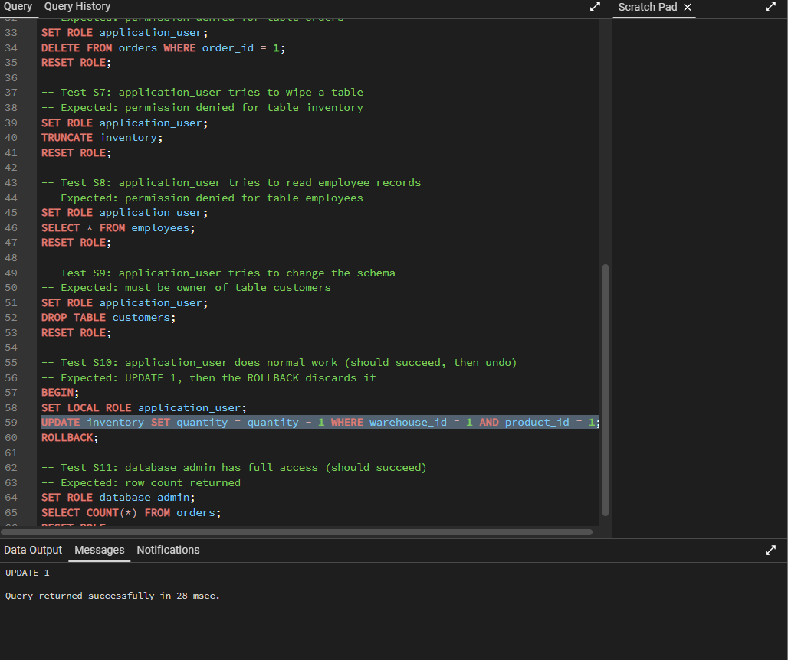

### Test S11: database_admin has full access
**Statement**
```sql
SET ROLE database_admin;
SELECT COUNT(*) FROM orders;
RESET ROLE;
```
**Expected:** row count returned
**Result**
```
count = 2
```
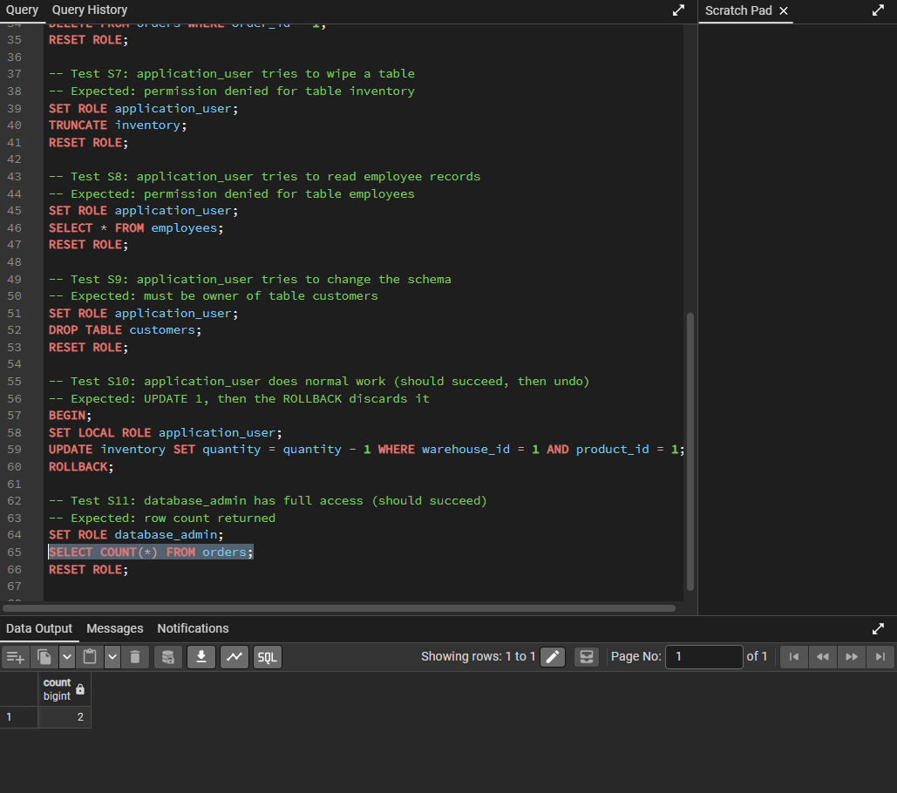

## Findings
- Least privilege is enforced: each role was refused the operations outside its job and allowed the ones inside it.
- Views let `reporting_user` read reports without any access to the underlying tables (compare S4 and S5).
- **Denial tests alone can pass for the wrong reason.** When `roles.sql` had not fully applied, roles had no privileges at all, so every "permission denied" test passed while the tests that should succeed (such as S11) failed. Each role therefore needs a matching test of what it is allowed to do, and the whole set was rerun after the grants were fixed.
- The role script is safe to re-run, which avoids partial setups when a role already exists.
